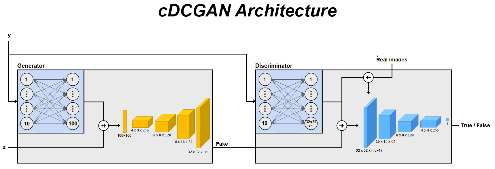
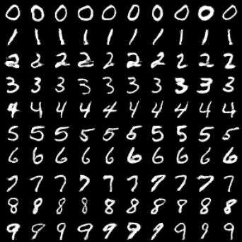
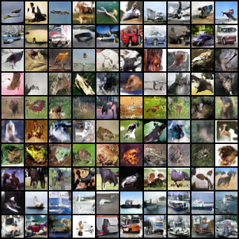

# cDCGAN
Pytorch implementation of cDCGAN. 
During my studies I had a lot of trouble finding a cDCGAN architecture that worked as I expected, so I decided to write my own version, finding an alternative way to condition it. 
Nothing particularly new, but it can be useful for educational purposes. 
This was used as a comparison with our meta-DCGAN-{1,2} MLP and meta-WGAN-gp 2MLP architectures 
## Architecture

## Example
 
## Metrics
### MNIST:
FID: 11.927998813352 
IS: (9.74927, 0.26216)

### CIFAR10:
FID: 35.16453 
IS: (3.86256, 0.14062)
